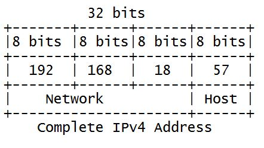
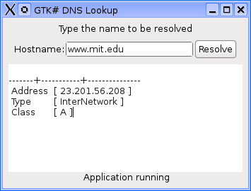
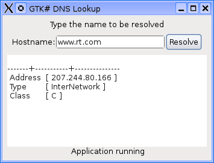
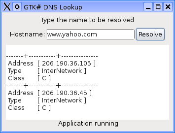
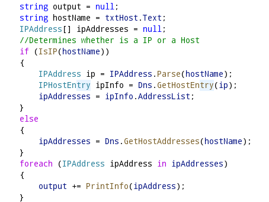

# Utilizando DNS (Domain Name System) en .NET con C#.
		

			Cualquier dispositivo conectado a una red TCP/IP siempre tiene asignado un identificador único de 32 bits que se le conoce como dirección IP (IP Address) o dirección de red. Esta dirección es jerárquica y consta de cuatro octetos (valores de 8 bits) que se dividen en dos partes: la primera parte identifica a la red y la segunda identifica los hosts (cualquier dispositivo conectado) en esa red. Las dos partes son requeridas para formar una dirección IP.
		

		
<b>Fig 1. Una dirección IP V4 jerárquica.</b>
 
		

		
		
 
		
Cada dirección IP identifica solamente a un único dispositivo en una red TCP/IP como Internet, aunque es una ventaja para las máquinas esto representa un problema para los humanos, ya que sería muy difícil para una persona  recordar cada una de los computadoras que utiliza por su dirección IP. 

		
Debido a que la gente asocia mucho mejor nombres para las cosas, los diseñadores de Internet inventaron el <b>DNS (Domain Name System)</b> que es una manera de asociar nombres que la gente puede recordar con la dirección IP de una máquina.

		<h3>DNS (Domain Name System)</h3>
		
Antes del DNS los dispositivos dependían de un único archivo de texto (/etc/hosts) como una tabla de hosts, para asociar los nombres de los sistemas en direcciones IP, a mediano plazo esta solución era ineficiente para mapear los nombres de hosts en direcciones, además de que no existía ninguna técnica para distribuir automáticamente la información acerca de los dispositivos recientemente agregados.

		
Por el contrario, DNS en lugar de depender de una sola gran tabla, es un sistema jerárquico de bases de datos distribuidas que no depende de una base de datos centralizada para resolver los nombres de hosts obteniendo las direcciones IP ya que DNS distribuye su información a través de miles de servidores de nombres. 
		En la parte superior de la jerarquía DNS, un grupo de servidores raíz sirven a un dominio raíz.
		

		<h3>Usando Domain Name System con las clases de .NET</h3>
		
.NET proporciona varias clases para apoyar la interacción con servidores DNS, las más comunes son: 

		
<b>IPAddress:</b> representa tal cual una dirección IP, la dirección misma esta disponible como la propiedad Address, y se convierte en su formato decimal con el método .ToString() también realiza la operación inversa con el método Parse() el cual recibe el formato decimal como argumento. 
		Además de estos métodos esta clase también tiene constantes estáticas que regresan las direcciones especiales Loopback y Broadcast.

		
<b>IPHostEntry:</b> encapsula toda la información referente a un dispositivo, lo  más utilizado de esta clase es: 

		<ol>
			<li><i>HostName:</i> regresa una cadena con el nombre del dispositivo.</li>
			<li><i>AddressList:</i> regresa un arreglo de objetos IPAddress con las direcciones IP asignadas al dispositivo.</li>
			<li><i>Aliases:</i> contiene un arreglo de alias asociados a un dispositivo.</li>
		</ol>
		
<b>Dns:</b> hace posible la comunicación con el servidor DNS predeterminado para la traducción de un nombre a su dirección IP o direcciones IP asociadas.
		Esta clase difiere de las clases <b>IPAddress</b> y <b>IPHostEntry</b> porque esta clase tiene la habilidad de comunicarse con servidores DNS para obtener información.
		Lo más utilizado de esta clase es:

		<ol>
			<li><i>GetHostName:</i> Obtiene el nombre de host del dispositivo local.</li>
			<li><i>GetHostEntry:</i> Resuelve una dirección IP o un nombre de host y regresa un objeto <b>IPHostEntry</b> con un arreglo de direcciones IP (objetos <b>IPAddress</b>).</li>
			<li><i>GetHostAddresses:</i> Regresa un arreglo de direcciones IP (objetos <b>IPAddress</b>)</li>
		</ol>
		
Como ejemplo de la utilización de estas clases escribí el siguiente programa que emula la funcionalidad de la utilidad <b>nslookup</b>, en esta caso utilizando las clases de .NET en una interfaz gráfica en GTK#.

		
<b>Fig 2. El programa obteniendo una dirección tipo A del host www.mit.edu.</b>
 
		

		
		
 
		
<b>Fig 3 El programa obteniendo una dirección tipo C del host www.rt.com.</b>
 
		

		
		
 
		
<b>Fig 4 Obteniendo una lista de direcciones IP clase C del host www.yahoo.com.</b>
 
		

		
		
 
		
En el código de la aplicación primero se distingue entre una dirección IP y el nombre de un host, según esta distinción se obtiene una clase <b>IPHostEntry</b> o bien un arreglo de clase <b>IPAddress</b>, al invocar el método <i>GetHostEntry</i> en el primer caso o el método <i>GetHostAddress</i> en el segundo.

		

		
		
 
		
En el primer caso se obtiene el arreglo de IPAddress de la propiedad AddressList en el segundo solamente se recorre y se imprime dicho arreglo.

		
<b>Nota:</b> El :NET Framework desde la version 1.1 soporta IPV6 a través de las clases que se encuentran en el ensamblado <i>System.Net</i>.

